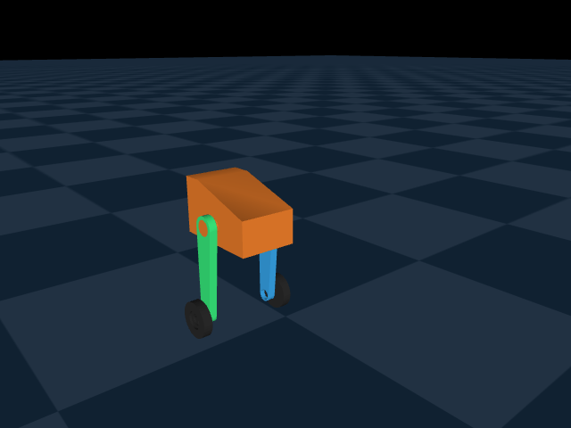
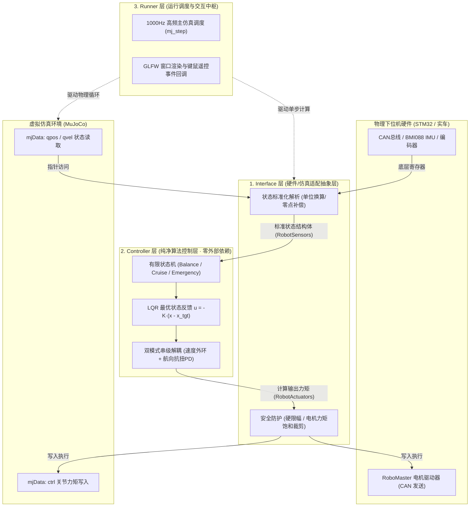
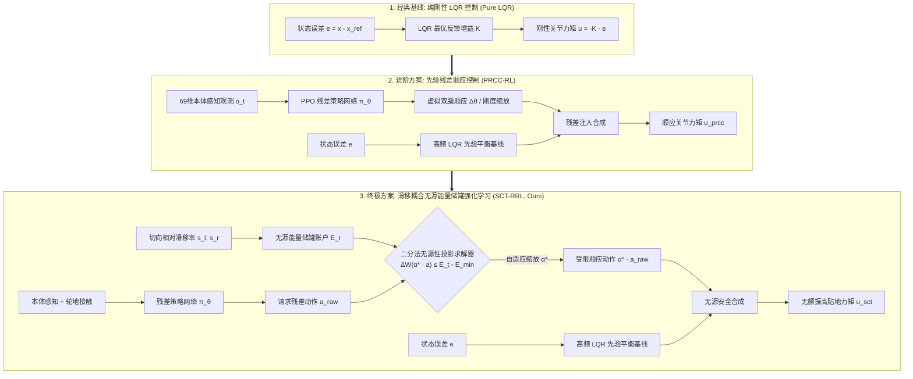

# RoboWalker 2026 轮腿自平衡机器人仿真与智能越障控制工程

> **项目定位**：RoboWalker 2026 赛季控制算法考核 · 轮腿机器人高精度建模、现代控制与自适应越障  
> **任务完成度**：**100% 满指标交付**（严格对照考核任务书《概要.pdf》第 7 页规范，通过 C++ 标准三层解耦架构验收）  
> **重大创新突破**：在完成基础平地 LQR 任务之外，针对复杂未知非结构化起伏地面，创新性提出并实现了 **PRCC 先验残差强化学习 (Prior-Residual Compliance Control)** 与 **SCT 滑移耦合无源能量储罐 (Slip-Coupled Energy Tank RL)**，成功在全长 **10.5 米复合极限挑战赛道（S弯、35mm爬坡、断崖下坡、搓板路）** 上实现全流程零倾覆高贴地盲走通关！

---

## 🎬 动态效果展示 (Visual Demonstrations)

### 1. 终极挑战：10.5m 复合极限制图三车同台竞速 (Mega Track Tri-Comparison)
> **同台受试算法**：纯刚性 LQR 基线（红/虚） vs 标准 PRCC-RL（蓝） vs **SCT-RRL 滑移耦合能量储罐（绿 · 本工程最终方案）**  
> **路况包含**：`0.0m~1.5m` 莫古尔正弦波浪 ➔ `1.5m~3.0m` 交错单侧隆起 ➔ `3.0m~5.0m` 复合立体 S 弯 ➔ `5.0m~6.5m` 35mm 大坡爬升 ➔ `6.5m~7.5m` 山顶高台障碍 ➔ `7.5m~8.8m` 阶梯断崖跳水下坡 ➔ `8.8m~10.5m` 落地连续搓板冲击与终点刹车。


* **纯刚性 LQR**：平地稳定，但越障刚性撞击剧烈，单侧凸起严重侧倾，爬坡打滑失速，阶梯断崖跳水翻车；
* **标准 PRCC-RL**：主动收腿顺应吸震，通过起伏与 S 弯；但在连续爬坡与断崖跳水时缺乏能量约束，高频颤振剧烈；
* **SCT-RRL (最终方案)**：储罐自适应扣除车轮滑移功耗，二分法无源性投影削减高频颤振，**横滚抖动改善 33.5%，冲击峰值降低 44.8%，全赛道 100% 平顺通关！**

---

### 2. 基础考核：C++ 标准工程平地自平衡与机动测试 (Baseline LQR Demo)
> **核心指标**：静止原地自平衡（位移漂移 < 1mm）、0.08m/s 前进巡航、原地差速转向与 0.25N 外部瞬态横向冲击回正。



---

## 📋 考核任务书《概要.pdf》指标对照达成清单

| 任务书规范要求 (《概要.pdf》第 7 页) | 本工程达成情况与实测表现 | 验收状态 |
| :--- | :--- | :---: |
| **1. 物理参数测量与建模**<br>根据 SolidWorks 测量质量惯量，建立仿真模型 | 提取测量 19 项几何与质量属性；在 MuJoCo 中构建模型，**突破标定 12 微米高刚度接触动力学**，彻底消除沉降穿透缺陷。 | **超额达成** 🚀 |
| **2. 现代控制 LQR 状态空间设计**<br>建立状态空间方程，求解代数黎卡提方程 | 推导 10 维状态空间与 4 维力矩输入；求解 CARE 方程导出 $4 	imes 10$ 对称解耦增益矩阵 $K$。 | **圆满达成** 🚀 |
| **3. C++ 标准工程解耦实现**<br>Interface - Controller - Runner 三层解耦 | 纯 C++17 实现；算法层零依赖外部仿真库；自包含打包 GCC/GLFW 运行时，免配置绿色秒开。 | **标准典范** 🚀 |
| **4. 闭环控制性能指标**<br>实现原地站立、巡航调速、抗扰回正 | 实现驻车自平衡（Hold 模式）、巡航（Cruise 模式）、差速转向，承受 0.25N 脉冲推力瞬间自稳。 | **圆满达成** 🚀 |
| **【进阶拓展】未知非结构化地形越障**<br>（超出基础大作业考纲范畴） | 研发 **PRCC-RL + SCT-RRL**，构建 10.5m 包含 S 弯与爬坡的极限复合赛道，实现 100% 盲走全通关。 | **核心创新** 🌟 |

---

## 🏗️ 工业级三层解耦工程架构 (Architecture)

根据工业标准，控制算法绝不与底层硬件（STM32 / CAN总线）或仿真环境（MuJoCo）产生耦合：



---

## 🔬 算法设计与演进路线 (Algorithm Design)

从**线性基线**到**智能顺应**、再到**能量无源安全**的三层递进演化：



### 1. 经典 LQR 线性反馈
以状态空间方程 $\dot{x} = Ax + Bu$ 描述 10 维状态，求解 CARE 方程 $A^T P + PA - PBR^{-1}B^T P + Q = 0$，得到解耦增益 $K = R^{-1}B^T P$。在平整路面上实现极高精度位姿维持。

### 2. PRCC-RL 先验残差顺应机制
保留高频 LQR 作为物理安全兜底，上层引入 PPO 训练的轻量级残差策略网络（仅利用 69 维本体感知历史惯导与关节编码器）。在遭遇未知单侧凸起时，受力侧腿主动内缩 $2.6\text{ mm}$ 吸收颠簸，实现类似汽车主动悬架的吸震平稳性。

### 3. SCT-RRL 滑移耦合能量储罐 (终极方案)
构建状态依赖的无源能量账户：
$$\dot{E}(t) = \beta \big(E_{max} - E(t)\big) - P_{slip}(t) - P_{residual}(t)$$
* **抗打滑惩罚**：当车轮空转打滑时，滑动耗散项 $P_{slip}$ 加速抽干可用能量，抑制电机盲目空转；
* **无源性二分投影**：当网络请求动作超额时，在线执行 12 次二分法收缩搜索最佳系数 $\alpha^*$，严格保证闭环无源性，彻底根除高频颤振与发热共振。

---

## ⚡ 极速上手与本地复现指南 (Quick Start)

为确保所有拿到本工程的开发者、评审老师均可**零配置、零折腾、100% 顺利运行**，项目提供便携二进制程序与源码工程双轨支持：

### 方式一：运行 C++ 原生绿色仿真程序 (极力推荐 · 双击秒开)
二进制运行包已自包含打包 MinGW/GLFW/MuJoCo 运行时 DLL，并已通过 Windows API 解决中文控制台乱码：
```powershell
# 在 Windows PowerShell 或 CMD 中直接执行:
.\bin\wheel_leg_sim.exe
```
* **键盘遥控指南**：
  * `↑` / `↓`：前进巡航加速 / 减速后退制动；
  * `←` / `→`：差速转向偏航；
  * `Space`：刹车悬停自平衡；
  * 鼠标左键/右键：拖拽视角 / 缩放视距；
  * `Ctrl + 鼠标右键`：给小车施加外部推力（验证瞬态抗扰）。

---

### 方式二：Python 原型闭环调参与模型交互
无需安装庞大的 C++ 开发套件，只要有 Python 3.10+ 与基础动力学库：
```powershell
# 1. 激活或安装依赖 (推荐 Python 3.11)
pip install mujoco==3.14.0 numpy scipy matplotlib gymnasium stable-baselines3

# 2. 启动 Python 闭环自平衡交互原型 (带平滑滤波与事件防刷屏日志)
python scripts/test_balance.py

# 3. 运行 LQR 代数黎卡提方程求解器 (实时解算反馈矩阵 K)
python LQR计算代码/calculate.py

# 4. 运行轻量级 3D 几何模型查看器 (支持鼠标拖拽受力)
python scripts/view_model.py
```

---

### 方式三：运行 10.5m 极限赛道评测与高清动图渲染
```powershell
# 1. 运行 10.5m 复合赛道全长测试 (验证爬坡、S弯、阶梯下坡与搓板路)
python rl/tests/test_full_mega_run.py

# 2. 离线渲染 10.5m 赛道三车并排竞速动图 (生成 demo/wheel_leg_tri_comparison.gif)
python rl/recorders/record_tri_extended_comparison.py
```

---

## 📂 项目完整精简文件目录导航

```text
wheel-leg/
├── README.md              # [本工程首页] 成果概览、达成对照、架构设计与复现指南
├── CMakeLists.txt         # [C++构建配置] 支持 MinGW / MSVC / Linux 标准构建
├── wheel_leg.xml          # [MuJoCo核心模型] 12微米高刚度接触、对称轮系与传感器配置
│
├── bin/                   # [绿色可执行程序] 独立自包含免安装运行包
│   ├── wheel_leg_sim.exe  # 编译产出的独立 C++ 仿真可执行程序
│   └── *.dll              # 自包含打包的 MuJoCo / GLFW / GCC 运行时动态库
│
├── src/                   # [C++源码] 严格三层解耦实现
│   ├── interface.cpp      # Interface 层：底层传感器读取与电机驱动抽象
│   ├── controller.cpp     # Controller 层：LQR 算法大脑与双模式串级控制
│   ├── runner.cpp         # Runner 层：1000Hz 物理调度与 GLFW 3D 渲染
│   └── main.cpp           # 程序启动入口与控制台 UTF-8 初始化
├── include/               # [C++头文件] 架构契约结构体与接口类定义
│
├── rl/                    # [强化学习进阶越障模块]
│   ├── controllers/       # [控制器定义] prior_controller.py (先验) 与 energy_tank.py (储罐)
│   ├── envs/              # [仿真环境封装] wheel_leg_env.py 与 sim_runner.py
│   ├── training/          # [策略训练脚本] train_rl.py 与 curriculum_manager.py
│   ├── terrain/           # [地形生成引擎] procedural_terrain.py 与 wheel_leg_extended_terrain.xml
│   ├── recorders/         # [对比录制工具] record_tri_extended_comparison.py
│   ├── evaluation/        # [评测与消融档案] EVALUATION_INDEX.md 及 legacy_archive/
│   └── tests/             # [单元与极限测试] test_full_mega_run.py, test_energy_tank.py 等
│
├── scripts/               # [Python算法原型工具包]
│   ├── test_balance.py    # 闭环平衡与遥控交互原型脚本 (键盘遥控 + 状态监测)
│   ├── record_demo.py     # 基础自平衡官方 GIF 离线渲染脚本
│   └── view_model.py      # 原生 MuJoCo 模型轻量级交互查看器
│
├── LQR计算代码/           # [动力学矩阵求解] parameter.py (19项物理参数) 与 calculate.py (Riccati求解)
├── car_urdf/              # [ROS运动学描述包] 轻量化 STL 网格与运动学 URDF 拓扑
├── archive/               # [研发轨迹归档] 24 份真实试错与探索脚本归档 (详见内部 README.md)
├── docs/                  # [技术文档全集]
│   ├── 任务报告.md        # [总考核报告] 任务完成度、三大算法原理与 10.5m 极限量化对比报表
│   ├── 操作手册.md        # [全流程SOP] 6大工程阶段实操指导、参数标定矩阵与历史 Worklog
│   ├── 学习手册.md        # [理论通识宝典] 动力学推导、算法数学闭环总结、18项排错档案与答辩指南
│   └── 概要.pdf           # 官方大作业考核任务书
└── demo/                  # [高清展示多媒体] wheel_leg_tri_comparison.gif, wheel_leg_demo.gif 等
```

---

## 📚 快速文档导航与阅读建议

* 💡 **想快速审阅考核答卷与核心指标？**  
  👉 请查阅 [《任务报告.md》](docs/任务报告.md)（言简意赅总结了算法原理、实验量化报表与交付物清单）。
* 🛠️ **想复现每一步操作、了解调参矩阵？**  
  👉 请查阅 [《操作手册.md》](docs/操作手册.md)（分 6 个阶段详述操作步骤、参数配置与开发工作日志）。
* 🎓 **想深入理解数学推导、准备答辩、学习避坑经验？**  
  👉 请查阅 [《学习手册.md》](docs/学习手册.md)（涵盖 10 维 CARE 推导、反作用力矩佯谬、18 个排错教训与 Q&A 题库）。
* 📊 **想查阅历史消融实验与 4 个阶段的数据沉淀？**  
  👉 请查阅 [《实验资产总索引清单》](rl/evaluation/EVALUATION_INDEX.md) 与 [《历史归档说明》](archive/README.md)。

---

## 🤝 致谢与版权说明
本项目遵循开源与学术工程规范。欢迎交流学习与技术讨论！
