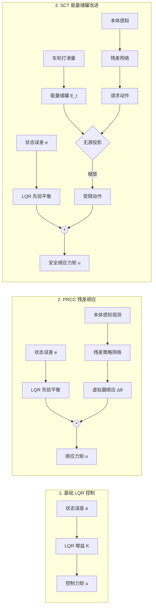
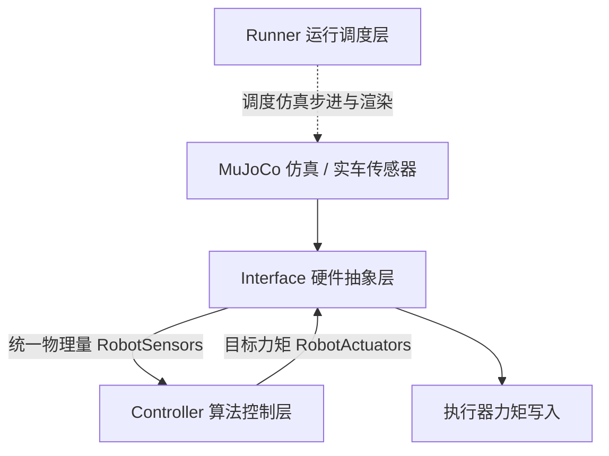

# RoboWalker 2026 轮腿自平衡机器人控制算法大作业

> **项目说明**：  
> 本项目为 RoboWalker 算法组招新考核大作业。在完成过程中，首先初步学习了 LQR 算法基础；`LQR计算代码/` 中的参数读取与 Riccati 方程求解、以及 `src/` 中的 C++ 控制与仿真骨架代码基本上先尝试独立编写完成，后续借助 AI 进行了代码微调与重构；考核要求之外的未知地形越障探索（PRCC 残差学习与能量储罐机制）则主要借助 AI 进行编程落地，本人负责把控物理机理、提出改进想法并对仿真实验结果进行评估分析。

---

## 🎬 动态效果展示

### 1. 进阶探索：10.5m 复合挑战赛道三算法对比
> 赛道涵盖起伏波浪、交错凸起、连续 S 弯、35mm 爬坡、山顶高台、阶梯断崖下坡与搓板路，直观对比三种控制方案的表现：


* **纯刚性 LQR**：平地自平衡良好，但遇到起伏与凸起时撞击剧烈；
* **PRCC 残差顺应**：利用神经网络自适应收腿顺应吸震，通过起伏与 S 弯，但在连续爬坡和大冲击下存在高频颤振；
* **SCT 能量储罐（改进方案）**：在残差基础上增加滑移功耗扣除与能量无源投影，抑制打滑空转与高频抖动，平稳通关。

### 2. 基础考核：C++ 原生工程平地自平衡与机动测试
> 包含原地站立自平衡、0.08m/s 前进巡航、差速转向与外部瞬态推力回正：


---

## 📋 考核任务完成情况对照

对照考核任务书《概要.pdf》规范要求，各项任务完成情况如下：

| 考核要求项 | 实现方法简述 | 完成状态 |
| :--- | :--- | :---: |
| **1. 物理参数测量与建模** | 从 SolidWorks 装配体中提取测量 19 项几何、质量与惯量参数；导出 URDF 并生成 MuJoCo `wheel_leg.xml`，标定高刚度接触参数消除地表沉降。 | 已完成 |
| **2. 状态空间方程推导与 LQR 求解** | 选取位移、偏航、双腿摆角、车身俯仰角及其导数构成 10 维状态空间；一阶线性化后求解连续代数黎卡提方程（CARE），得到最优状态反馈增益矩阵 $K$。 | 已完成 |
| **3. C++ 仿真工程落地** | 采用纯 C++17 编写，严格分离硬件抽象、控制算法与运行循环；算法层零依赖外部仿真库，自带运行时依赖，支持原生编译运行。 | 已完成 |
| **4. 闭环控制与运动表现** | 实现了原地自平衡（Hold 模式）、前后巡航调速（Cruise 模式）、差速转向以及 0.25N 外部推力冲击恢复。 | 已完成 |
| **【任务外探索】复杂地形顺应越障** | 在 LQR 先验基础上引入本体感知残差顺应律（PRCC）与滑移耦合能量储罐（SCT），构建 10.5m 复合赛道验证了复杂地形下的越障能力。 | 探索完成 |

---

## 🏗️ 控制算法与工程架构设计

### 1. 算法演进结构
算法从基础线性反馈向自适应越障逐步递进：



* **LQR 基础层**：通过线性二次型调节器保证平地直立平衡与抗扰稳定性；
* **PRCC 残差层**：利用轻量策略网络依据本体感知输出双腿虚拟收缩量，在遭遇凸起时主动吸震；
* **SCT 储罐层**：通过动态能量账户监控轮地滑移，超出安全能量预算时自动缩放动作，保证系统无源性并消除电机颤振。

### 2. C++ 三层解耦工程架构
代码严格遵循模块化解耦规范，便于未来向真实下位机移植：



* **Interface（硬件抽象层）**：负责底层传感器数据读取、单位换算以及执行器力矩安全限幅；
* **Controller（算法控制层）**：纯 C++ 实现，包含有限状态机、LQR 计算与串级控制，不依赖任何仿真库头文件；
* **Runner（运行调度层）**：调度 1000Hz 物理仿真推进并处理 GLFW 窗口交互与按键事件。

---

## 💻 本地运行与复现指南

项目同时提供已编译的可执行程序与 Python 源码两种运行途径：

### 1. C++ 原生程序运行（无需配置环境）
二进制目录下已内置所需动态链接库，Windows 环境下可直接启动：
```powershell
.\bin\wheel_leg_sim.exe
```
* **控制指令**：
  * `↑` / `↓`：前进加速 / 减速与倒车；
  * `←` / `→`：差速转向；
  * `Space`：刹车悬停；
  * 鼠标左键 / 右键：旋转视角 / 缩放视距；
  * `Ctrl + 鼠标右键`：给小车施加外部推力（测试抗扰性能）。

如需在本地使用 CMake 重新编译：
```powershell
cmake -B build
cmake --build build --config Release
```

### 2. Python 原型与仿真脚本运行
需配备 Python 3.10+ 环境并安装基础依赖：
```powershell
pip install mujoco==3.14.0 numpy scipy matplotlib gymnasium stable-baselines3
```

常用功能脚本：
```powershell
# 启动 Python 闭环自平衡交互仿真
python scripts/test_balance.py

# 求解连续代数黎卡提方程导出增益矩阵 K
python LQR计算代码/calculate.py

# 运行 3D 模型轻量级查看器
python scripts/view_model.py

# 运行 10.5m 复合赛道测试
python rl/tests/test_full_mega_run.py
```

---

## 📂 项目文件结构索引

```text
wheel-leg/
├── README.md              # 项目总体说明与快速指引
├── CMakeLists.txt         # C++ 工程构建脚本
├── wheel_leg.xml          # MuJoCo 物理模型配置文件
│
├── bin/                   # 独立可执行程序目录 (含 wheel_leg_sim.exe 及依赖 DLL)
├── include/               # C++ 头文件 (interface.h, controller.h, runner.h)
├── src/                   # C++ 源文件 (interface.cpp, controller.cpp, runner.cpp, main.cpp)
│
├── LQR计算代码/           # 动力学参数 (parameter.py) 与 Riccati 求解脚本 (calculate.py)
├── car_urdf/              # 从 SolidWorks 导出的 URDF 拓扑与 STL 网格模型
├── scripts/               # Python 原型与调参交互脚本 (test_balance.py, view_model.py 等)
├── rl/                    # 强化学习与地形越障进阶模块 (环境、模型、控制器与评测代码)
├── docs/                  # 详细技术文档
│   ├── 任务报告.md        # 算法原理、实验指标与量化对比总结
│   ├── 操作手册.md        # 完整工程推进阶段指南与开发日志
│   ├── 学习手册.md        # 动力学推导、算法数学总结、避坑记录与答辩复习题
│   └── 概要.pdf           # 官方大作业任务书
└── demo/                  # 成果演示 GIF 动图
```

---

## 📚 详细文档查阅导航

如需进一步了解技术细节与推导过程，可参考 `docs/` 目录下的配套文档：
* **[《任务报告.md》](docs/任务报告.md)**：包含任务概述、各阶段算法设计思想与量化数据对比；
* **[《操作手册.md》](docs/操作手册.md)**：包含全流程步骤说明、关键参数标定表与阶段工作日志；
* **[《学习手册.md》](docs/学习手册.md)**：包含双轮倒立摆动力学方程推导、Riccati 方程数学原理、18 个排错避坑记录。
