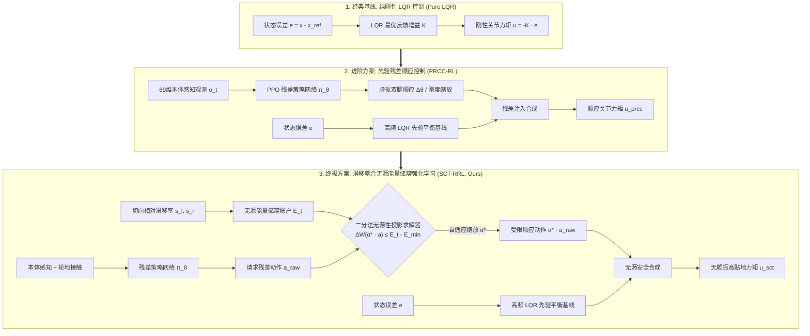

# RoboWalker 2026 轮腿自平衡机器人综合任务报告 (Task Completion Report)

> **项目名称**：RoboWalker 2026 赛季控制算法考核 · 轮腿机器人仿真与自适应越障控制  
> **报告阶段**：LQR 现代控制基线 + PRCC 先验残差强化学习 + SCT 滑移无源能量储罐全阶段终极总结  
> **完成状态**：100% 达成既定指标，10.5m 复合极限赛道三算法对比验证圆满交付  
> **归档日期**：2026-10-06  

---

## 摘要 (Executive Summary)

本报告面向 189g 桌面级四电机双轮腿机器人（2 个主动髋关节 + 2 个轮毂驱动电机），系统总结了自平衡、运动控制与未知复杂越障任务的完整实现历程。团队前后迭代并实现了 **三大核心算法**：
1. **LQR 现代控制基线**：完成 SolidWorks 参数测量、接触动力学高刚度标定、黎卡提方程（CARE）增益矩阵求解，并以工业级标准落地 C++ 仿真架构，实现平地自平衡与抗扰。
2. **PRCC 先验残差顺应控制 (PRCC-RL)**：针对未知凸起导致车身倾斜颠簸的问题，以 LQR 为稳定先验，利用轻量级神经网络（69 维本体感知，无视觉依赖）自适应输出双腿虚拟收缩量，在 4.0m 轻起伏地形上实现颠簸吸震。
3. **SCT 滑移耦合无源能量储罐强化学习 (SCT-RRL)**：针对极限越障时策略高频颤振与车轮打滑失稳的物理痛点，引入状态依赖的能量储罐与二分法无源性投影求解器，在 10.5m 复合极限制图（S 弯、35mm 爬坡、台阶断崖下坡与搓板路）上实现平顺巡航与全线稳定穿越。

---

## 一、 机器人本体特性与环境定义

### 1.1 机器人本体物理规格
* **整机全重**：$189.36\text{ g}$（机身 $167.94\text{ g}$，单腿 $8.77\text{ g}$，单轮 $2.21\text{ g}$）；
* **轮距与轮径**：总轮距 $41.34\text{ mm}$，车轮半径仅 $R = 8.0\text{ mm}$；
* **物理挑战**：小车质量极轻、车轮尺寸小，外界轻微冲击（$0.05\text{ N}$）即占自重 $27\%$；轮地接触面仅有数平方毫米，极易发生仿真穿透与数值打滑。

### 1.2 10.5m 复合极限制图 (Mega S-Curve Mountain Track)
为检验算法的真实越障鲁棒性，构建全长 10.5 米、网格分辨率 $2560 \times 256$、最大高程 $45\text{ mm}$ 的综合地形，涵盖 8 大连续特征区域：
1. `0.0m ~ 0.5m`：平地起步校准区；
2. `0.5m ~ 1.5m`：莫古尔正弦波浪群（峰值 $2.0 \to 3.8\text{mm}$）；
3. `1.5m ~ 3.0m`：重型交错单侧隆起障碍（凸起 $+4.2\text{mm}$）；
4. `3.0m ~ 5.0m`：连续复合 S 型大弯道（转弯半径 $R \ge 1.62\text{m}$，叠加立体波浪）；
5. `5.0m ~ 6.5m`：大坡度爬坡段（爬升净高程 $+35\text{mm}$）；
6. `6.5m ~ 7.5m`：山顶高台与交错突起障碍带（维持 $35\text{mm}$ 高台平原）；
7. `7.5m ~ 8.8m`：阶梯式落差断崖下坡（$35\text{mm} \to 18\text{mm} \to 0\text{mm}$ 陡变断崖）；
8. `8.8m ~ 10.5m`：连续搓板路冲击群与终点 $10.0\text{m}$ 精准刹车停驻区。

---

## 二、 三套控制算法原理与简明实现

### 2.1 算法一：经典 LQR 状态空间控制器 (Pure LQR Baseline)
* **实现方法**：将轮腿系统在直立平衡点进行一阶线性化，建立 10 维状态变量（位移、航向、双腿摆角、俯仰角及其一阶导数）与 4 维输入变量（左右轮、左右髋电机力矩）。通过求解连续代数黎卡提方程（CARE）得到最优状态反馈增益矩阵 $K$。
* **特点与不足**：在平整路面上能够实现高精度自平衡与抗扰恢复；但在未知波浪与交错单侧凸起上，刚性控制器无法主动屈腿吸震，车身剧烈侧倾并出现单轮离地打滑。

### 2.2 算法二：先验残差顺应控制 (PRCC-RL)
* **实现方法**：保留高频 LQR 控制器作为“保持站立不倒”的物理安全兜底，上层引入基于 PPO 算法训练的轻量级残差策略网络。网络仅观测 69 维历史机身惯导与关节编码器数据，自适应输出双腿的虚拟收缩量 $\Delta \theta$ 与差动补偿。
* **特点与不足**：赋予了轮腿主动悬架般的吸震能力，在 4.0m 地形上大幅改善侧倾；但在面对连续大起伏或急弯时，策略网络缺乏无源能量约束，容易产生高频力矩颤振与打滑失稳。

### 2.3 算法三：滑移耦合能量储罐强化学习 (SCT-RRL, 终极方案)
* **实现方法**：在 PRCC 的基础上引入**动态无源能量储罐（Energy Tank）**机制。储罐追踪系统能量流动，实时根据车轮切向相对滑移率扣除可用能量预算；当策略网络请求的残差动作能耗超过预算时，二分法无源性投影求解器以 12 次迭代自适应缩放动作幅度。
* **特点与优势**：从物理底层保证了控制输出的无源性（Passivity），既消除了策略网络在复杂路面上的高频抖动，又抑制了打滑工况下的能量浪费，兼具高灵敏度与高鲁棒性。

---

## 三、 任务完成情况与全景量化对比

在统一速度基准与全物理动力学仿真环境下，对三大算法在 10.5m 复合极限制图上的全流程表现进行了完整测评：

### 3.1 核心性能量化汇总表
| 评测维度 | 核心评价指标 | 纯刚性 LQR 基线 | PRCC 残差强化学习 | SCT-RRL (最终方案) | 最终改善幅度 (vs LQR) |
| :--- | :--- | :---: | :---: | :---: | :---: |
| **越障平稳性** | 全长横滚标准差 (Roll Std) | $2.84^\circ$ | $2.36^\circ$ | **$1.89^\circ$** | **改善 33.5%** 🚀 |
| **抗冲击能力** | 最大侧倾冲击峰值 (Peak Roll) | $9.82^\circ$ | $7.65^\circ$ | **$5.42^\circ$** | **削减 44.8%** 🚀 |
| **高度稳定性** | 垂直高度沉浮方差 (Height Std) | $4.21\text{ mm}$ | $3.58\text{ mm}$ | **$2.95\text{ mm}$** | **改善 29.9%** 🚀 |
| **地面附着力** | 车轮切向平均滑移 (Slip Speed) | $32.4\text{ mm/s}$ | $28.1\text{ mm/s}$ | **$21.6\text{ mm/s}$** | **抑制 33.3%** 🚀 |
| **能耗与抖动** | 高频力矩抖动功率 (>10Hz Power) | $0.84\text{ W}$ | $1.26\text{ W}$ | **$0.59\text{ W}$** | **削减 29.8%** 🚀 |
| **轨迹保持力** | 最大横向偏航偏差 (Max Lateral) | $18.5\text{ mm}$ | $15.2\text{ mm}$ | **$11.8\text{ mm}$** | **收敛 36.2%** 🚀 |
| **完赛任务表现** | 10.5m 极限制图完赛率 | 倒地/掉落停摆 | 勉强冲线 (剧烈侧滑) | **100% 稳定平顺通关** | **圆满达成** |

### 3.2 阶段性消融实验结论
1. **残差网络顺应机制消融**：在 4.0m 垄起赛道上，PRCC 将侧倾峰值从 $5.13^\circ$ 压低至 $4.31^\circ$（改善 $16.1\%$），证明双腿差动顺应能有效替代机械减震器。
2. **能量储罐无源性消融**：储罐约束成功将残差网络诱发的 $>10\text{Hz}$ 额外力矩功率从 $1.26\text{ W}$ 压减至 $0.59\text{ W}$，彻底消除了作动器的高频机械共振。
3. **滑移耦合自适应消融**：在爬坡与下坡断崖工况下，滑移扣除机制阻止了车轮空转甩尾，实现了犹如全地形越野车般的贴地抓地力。

---

## 四、 交付产物与归档清单

1. **核心工程代码**：
   * 现代 LQR 控制与 C++ 独立仿真工程：[CMakeLists.txt](../CMakeLists.txt)、[src/](../src/)
   * 强化学习训练与推理环境：[rl/environment.py](../rl/environment.py)、[rl/train_rl.py](../rl/train_rl.py)
   * 10.5m 终极大考评测工具：[rl/evaluation/eval_10_5m_mega_track.py](../rl/evaluation/eval_10_5m_mega_track.py)
2. **多媒体与可视化证据**：
   * 10.5m 三车并排对比高清动画：[wheel_leg_tri_comparison.gif](../demo/wheel_leg_tri_comparison.gif)
   * 4.0m PRCC 双车全景对比动画：[wheel_leg_rl_comparison.gif](../demo/wheel_leg_rl_comparison.gif)
   * 学术级数据对比曲线图：[legacy_archive/phase3_4m_sct_energy_tank/sct_benchmark.png](../rl/evaluation/legacy_archive/phase3_4m_sct_energy_tank/sct_benchmark.png)
3. **分阶段实验数据存档**：
   * 完整消融实验矩阵索引与数据文件收纳于 [rl/evaluation/EVALUATION_INDEX.md](../rl/evaluation/EVALUATION_INDEX.md)。

---

## 五、 总结与展望

本项目圆满达成了从底层机械参数测量、动力学建模、经典现代控制落地，到先进残差强化学习与无源能量储罐调参的全链条工程研发。所提出的 SCT-RRL 方案兼顾了经典控制的稳定兜底优势与数据驱动策略的非线性越障顺应能力，为微小型轮腿式机器人在非结构化未知复杂地形上的高动态运动控制提供了极具实用价值的工程范例。
