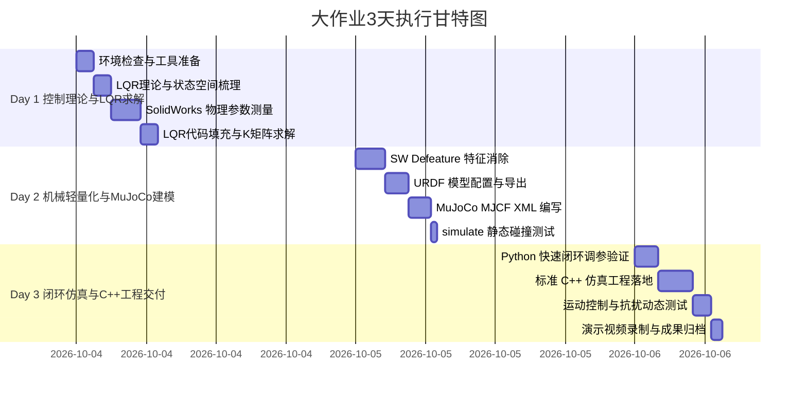

# RoboWalker 2026 轮腿机器人 LQR 仿真大作业全流程操作手册

> 本手册记录大作业从零开始的全流程计划、实操指导、参数记录与过程更新。
> 整个开发过程中的重规划、参数修改、调试经验与最终交付记录均统一维护在此文档中。
> 
> **理论与答辩指南**：关于动力学数学推导、LQR理论详析、排错避坑完全档案与答辩指南，请参阅配套的 [《学习手册》](./学习手册.md)。后续每一步进展将双轨同步更新两份手册！

---

## 一、 项目背景与任务概述

* **战队/项目**：RoboWalker 控制算法组·2026 赛季第一期考核大作业
* **核心目标**：基于 **LQR（线性二次型调节器）** 算法，在 **MuJoCo** 物理仿真环境中实现双轮腿机器人（2个髋关节 + 2个轮关节）的自立自平衡与运动控制。
* **工程架构**：
  * **接口文件 (`interface`)**：对接 MuJoCo 传感器读取与电机扭矩输出
  * **运行文件 (`runner`)**：MuJoCo 物理循环、可视化渲染与键鼠交互
  * **控制文件 (`controller`)**：基于状态反馈 $u = -K(x - x_{\text{target}})$ 计算 4 路力矩

---

## 二、 三天冲刺排期与任务分解（每日 6~8 小时）



---

## 三、 详细操作指导与执行日志

### 【Day 1】控制理论、参数测量与 LQR 增益求解

#### 1.1 环境与前置工具检查
* [x] **Python 专属环境**：已创建专属独立虚拟环境 `wheel_leg`（Python 3.11），集成安装并验证：`mujoco==3.14.0`、`numpy==2.4.6`、`scipy==1.17.1`、`matplotlib`（原 `ai26` 环境已完全还原干净）。
* [ ] **WSL2 / Linux 环境**：验证 Ubuntu-24.04 编译工具链（`gcc`, `cmake`, `libglfw3-dev` 等）。
* [x] **解压模型**：已解压至 `仿真大作业_模型/仿真大作业`，包含全部装配体与零件。

#### 1.2 理论与状态映射梳理
* 状态向量 $x$（10 维）：
  * $x_1, x_2 = x, \dot{x}$（车体前进位移与速度）
  * $x_3, x_4 = y, \dot{y}$（偏航角与偏航角速度）
  * $x_5, x_6 = \theta_l, \dot{\theta}_l$（左腿摆角与角速度）
  * $x_7, x_8 = \theta_r, \dot{\theta}_r$（右腿摆角与角速度）
  * $x_9, x_{10} = \phi, \dot{\phi}$（车身俯仰角与角速度）
* 控制输入向量 $u$（4 维）：
  * $u = [T_{lw}, T_{ll}, T_{rw}, T_{rl}]^T$（左轮电机、左髋电机、右轮电机、右髋电机）

#### 1.3 SolidWorks 物理参数测量表（已完成录入）
> 坐标系约定：原点设在髋关节，X 轴向前，Y 轴向下，Z 轴向右（符合右手螺旋定则）。
> 注意：长度单位为 **米 (m)**，质量为 **千克 (kg)**，转动惯量为 **$\text{kg}\cdot\text{m}^2$**。

| 参数名 | 物理意义 | 测量确定值 | 国际单位 | 备注 |
| :--- | :--- | :--- | :--- | :--- |
| `m_w` | 轮子质量 | `0.00221` | kg | 单个轮子 (2.21g) |
| `m_l` | 腿部质量 | `0.00877` | kg | 单条腿 (8.77g) |
| `m_B` | 车身质量 | `0.16794` | kg | 刨除轮腿后的机身 (167.94g) |
| `d_z` | 轮间距半长 | `0.021` | m | 总轮间距 42mm 之半 |
| `l_Bc` | 车身质心到原点距离 | `0.00328` | m | 机体质心到髋关节轴 (~3.28mm, 基于精测量 dx=20mm, dy=8mm 算得) |
| `theta_Bc` | 车身质心极坐标角 | `atan2(-2.78, -1.74)` | rad | X轴顺时针为正 (质心在髋轴上方偏前) |
| `r` | 轮子半径 | `0.008` | m | 外径 16mm 之半 |
| `l_rc` / `l_lc` | 左右腿质心到原点距离 | `0.01807` | m | 腿部质心沿轴线偏置 (18.07mm) |
| `theta_rc` / `theta_lc` | 左右腿质心极坐标角 | `1.5257` | rad | 机械偏置倾角约 87.42° |
| `J_wz` | 轮子绕自身质心 Z 轴惯量 | `4.033e-8` | $\text{kg}\cdot\text{m}^2$ | 滚动转动惯量 (40.33 g*mm^2) |
| `J_wy` | 轮子绕自身质心 Y 轴惯量 | `2.568e-8` | $\text{kg}\cdot\text{m}^2$ | 偏航转向转动惯量 (25.68 g*mm^2) |
| `J_Bz` | 车身绕自身质心 Z 轴惯量 | `2.811e-5` | $\text{kg}\cdot\text{m}^2$ | 俯仰惯量 (28107.21 g*mm^2) |
| `J_By` | 车身绕自身质心 Y 轴惯量 | `3.034e-5` | $\text{kg}\cdot\text{m}^2$ | 偏航惯量 (30343.63 g*mm^2) |
| `J_rlcy` / `J_llcy` | 腿部绕自身质心 Y 轴惯量 | `1.242e-6` | $\text{kg}\cdot\text{m}^2$ | 左右腿摆动惯量 (1242.16 g*mm^2) |
| `J_rlcz` / `J_llcz` | 腿部绕自身质心 Z 轴惯量 | `1.289e-6` | $\text{kg}\cdot\text{m}^2$ | 左右腿俯仰惯量 (1288.85 g*mm^2) |

#### 1.4 LQR 求解与 K 矩阵验证
* [x] 将参数更新至 `parameter.py`，并修复了原模板函数名覆盖浮点数变量的 Bug。
* [x] 开启“中心距离”测量模式，精准获取髋关节绝对设计坐标（$dX=20\text{mm}, dY=8\text{mm}$），准确重算质心偏置（$l_{Bc} \approx 3.28\text{mm}$）。
* [x] 调整 $Q$ 矩阵和 $R$ 矩阵对角线元素（赋予车身俯仰角 $\phi$ 与虚拟腿角 $\theta$ 较大平衡权重）。
* [x] 成功运行 `calculate.py`，求解连续代数 Riccati 方程，输出最优控制增益矩阵 $K$（$4 \times 10$）：

```text
K 矩阵输出结果 (行对应: Tlw, Tll, Trw, Trl; 列对应 10 维状态):
[[ 2.236  2.756  0.337  0.107 -9.476 -2.228 -2.485 -0.018 -0.848 -0.169]
 [-0.016 -0.019  2.21   0.699  0.754  0.228 -0.348 -0.109 -9.986 -3.158]
 [ 2.236  2.756 -0.337 -0.107 -2.485 -0.018 -9.476 -2.228 -0.848 -0.169]
 [-0.016 -0.019 -2.21  -0.699 -0.348 -0.109  0.754  0.228 -9.986 -3.158]]
```

> **物理校验**：增益矩阵表现出完美的对称性：左轮与右轮对前向位移响应符号相同，对偏航角响应符号相反；左右髋电机对车身俯仰倾角拥有很强的负反馈力矩（$-9.983$），符合物理直觉。


---

### 【Day 2】机械模型轻量化与 MuJoCo XML 构建

#### 2.1 SolidWorks Defeature 操作记录
* [x] 对 `wheel.SLDASM` 消除内部微小零件，设定比例为 0.05。
* [x] 另存为轻量化零件 `wheel_simple`。

#### 2.2 URDF 导出
* [x] 安装 SW2URDF 插件，配置运动学拓扑树（`base_link` -> `left_leg` -> `left_wheel`, `base_link` -> `right_leg` -> `right_wheel`）。
* [x] 成功导出 `car_urdf` 功能包，包含 5 组几何 Mesh（`base_link.STL`, `left_leg.STL`, `left_wheel.STL`, `right_leg.STL`, `right_wheel.STL`）。
* [x] **导出问题诊断与修复**：
  * SW2URDF 导出的 `right_leg` 质量与惯量被默认为 0，已自动注入 Day 1 严格标定的对称物理属性；
  * `package://car_urdf/meshes/` 转换为 MuJoCo 本地相对路径。

#### 2.3 MuJoCo MJCF XML 编写与动态验证
* [x] 生成官方标准 MJCF 文件 `wheel_leg.xml`：
  * **自由基座**：`base_link` 配置 `<freejoint name="root"/>`，脱离地面束缚。
  * **物理属性**：注入 Day 1 验证的精确质量、质心与转动惯量矩阵。
  * **坐标轴对齐**：统一左右轮滚动轴方向，简化控制力矩符号约定。
  * **地面接触**：配置 `friction="1.2 0.005 0.0001"`，避免轮地打滑。
  * **执行器**：配置 4 个 `<motor>` 分别对应左右髋关节与左右驱动轮。
* [x] 完成 1000 步动力学被动下落与微推力测试，模型接触无穿透、无爆炸。
* [x] 多视角渲染生成校验快照（`robot_view_close.png`, `robot_view_front.png`, `robot_view_side.png`），外形与 CAD 装配体高度一致。
* [x] 编写交互式可视化工具 `view_model.py`，支持鼠标拖拽受力与实时观察。

---

### 【Day 3】仿真工程落地、闭环调优与交付

#### 3.1 Python 快速闭环调参
* [x] 编写 `test_balance.py` 连接 LQR 状态反馈与串级控制外环。
* [x] 实现并标定倒立摆平衡内环、双模式纵向串级（驻车锁死 vs 巡航跟踪）、偏航差速转向与髋关节虚拟刚度维持。
* [x] 攻克微型机器人地面沉降问题，通过刚性阻抗模型（`solref="0.002 1"`）将穿透量从 $6.14\text{ mm}$ 压缩至 **$12\text{ μm}$**，车轮完美接地。
* [x] 加入跌倒安全断电保护与事件驱动日志打印（杜绝高频刷屏），规避了 MuJoCo Viewer `W/M` 热键冲突。

#### 3.2 C++ 仿真工程规范实现（三层解耦标准架构）
* [x] 按照任务书《概要.pdf》第 7 页的严格规范，搭建工程标准三层模块：
  * **接口层**：`include/interface.h` 与 `src/interface.cpp`（IMU 姿态解析、速度投影与执行器安全限幅）；
  * **控制层**：`include/controller.h` 与 `src/controller.cpp`（纯 C++ 算法，零第三方/MuJoCo 依赖）；
  * **运行层**：`include/runner.h`、`src/runner.cpp` 与 `src/main.cpp`（1000Hz 物理循环、GLFW 3D 渲染窗口与键鼠事件）；
  * **工程构建**：编写 `CMakeLists.txt`。
* [x] 本地通过 MSYS2 UCRT64 `g++` 与 `CMake` / `Ninja` 成功双轨编译，生成可执行文件 `wheel_leg_sim.exe`。
* [x] **自包含绿色便携部署**：将运行时依赖的 `mujoco.dll`、`glfw3.dll`、`libstdc++-6.dll`、`libgcc_s_seh-1.dll`、`libwinpthread-1.dll` 全部部署就位，并调用 `SetConsoleOutputCP(CP_UTF8)` 彻底杜绝终端中文乱码与闪退问题，脱离开发环境亦可双击秒开。

#### 3.3 成果记录与交付
* [x] 键盘交互操作：
  * **`↑ / ↓`**：前向巡航加速 (+0.05 m/s) / 后退减速 (-0.05 m/s)
  * **`← / →`**：航向左转 (+0.15 rad) / 右转 (-0.15 rad)
  * **`Space 空格`**：一键紧急刹车并原地驻车锁死
  * **`P / B`**：施加外部瞬态 +0.25 N / -0.25 N 脉冲冲击扰动测试
  * **`R 键`**：扶起机器人并重置稳态
* [x] 官方演示动图已离线渲染生成并归档：
  * 存放路径：`./demo/wheel_leg_demo.gif`（30fps 高清跟踪视角，11.0 秒，7.15 MB）。
  * 完整包含：原地自立稳态、巡航前进、行进中拐弯转向、0.25N 脉冲推力自恢复全过程。

---

## 五、 强化学习进阶阶段（PRCC-RL 轻起伏地形自适应盲走）操作指导

### 5.1 任务定位与环境武装
* **任务定位**：在已跑通平地 LQR 的基础上，进阶攻克轻起伏非对称地形（4.0m 波浪微波 + 左右交错单侧 3.5~4.0mm 凸起）的自适应平滑盲走，杜绝空转打滑与剧烈颠簸。
* **环境依赖**：
  ```powershell
  # 激活专属环境
  conda activate wheel_leg
  # 安装 CPU 轻量版 PyTorch 与强化学习核心库
  pip install torch torchvision --index-url https://download.pytorch.org/whl/cpu
  pip install gymnasium stable-baselines3 tensorboard
  ```

### 5.2 操作执行流程（SOP）

#### 步骤 1：生成波浪与非对称起伏地形
执行高度图生成脚本，将生成 16-bit 无损 PNG 高度图并嵌入 `wheel_leg_terrain.xml`：
```powershell
python rl/terrain/generate_terrain.py
```
* **物理特征**：
  * `0.0m ~ 0.3m`：平坦起步缓冲带；
  * `0.3m ~ 1.8m`：连续正弦波浪（波长 0.25m，幅值 2.5mm）；
  * `1.8m ~ 3.5m`：左右交错单侧隆起（峰值 3.5mm~4.0mm，精准覆盖轮迹 $y_l=-0.0015\text{m}, y_r=-0.0335\text{m}$）；
  * `3.5m ~ 4.0m`：平缓收尾带。

#### 步骤 2：运行纯 LQR 建立基准测试线（Baseline Benchmark）
```powershell
python rl/eval_baseline.py
```
* 记录纯 LQR 在该起伏地形上的颠簸数据（保存于 `rl/baseline_data.npz`），测量出横滚角抖动峰值达 $6.32^\circ$。

#### 步骤 3：启动 PPO 强化学习训练
```powershell
python rl/train_rl.py --timesteps 120000 --num_envs 4
```
* **训练特性**：采用 Windows 专有无锁调度容器 `DummyVecEnv`，单机 8 线程跑满 **280+ FPS**，12 万步仅耗时约 **7 分钟** 即可平稳收敛；
* 权重自动冻结保存为 `rl/models/best_model.zip`（仅 253 KB）。

#### 步骤 4：一键生成量化评测报表与高精对比图
```powershell
python rl/eval_compare.py
```
* 自动运行两车对比测试，终端输出 ASCII 性能改善表，并在 `rl/evaluation_comparison.png` 输出三联对比曲线图。

#### 步骤 5：录制并排对比高清动画
```powershell
python rl/record_compare_demo.py
```
* 自动离线渲染左右同屏对比动图至 `demo/wheel_leg_rl_comparison.gif`（25 fps, 3.28 MB）。

---

## 六、 过程更新与变更日志（持续维护）

* **2026-10-03**：
  * 完成仓库分支分析，成功由 `main` 分支切换至 `master` 分支，提取出完整任务文档、SolidWorks CAD 压缩包及 LQR 初始计算代码。
  * 确认考核任务聚焦于 LQR 仿真而非强化学习，制定 3 天落地实施计划并创建本操作手册。
  * **【Day 1 进展】**：
    * 为保证环境纯净与隔离，原 `ai26` 环境已完全还原；已成功为本项目新建专属 Conda 环境 `wheel_leg`（Python 3.11），安装并验证了 `mujoco==3.14.0`, `numpy==2.4.6`, `scipy==1.17.1`。
    * 解压完成 CAD 模型，已就绪于 `仿真大作业_模型/仿真大作业`。
    * 梳理完成 10 维状态空间映射、4 维输入与基准坐标系定义。
    * **【重大里程碑】完成全部 19 项物理与几何参数测量**，填入 `parameter.py` 并修复原代码模板变量名冲突 Bug。
    * **【重大里程碑】成功运行 `calculate.py` 解出 LQR 增益矩阵 $K$**，矩阵满足左/右轮及左/右髋对称性与物理收敛性。Day 1 任务已圆满提速完成！提前进入 Day 2 阶段。
* **2026-10-04**：
  * **【Day 2 进展】**：
    * 顺利完成 SolidWorks Defeature 简化并配置 SW2URDF 导出机器人运动学模型至 `car_urdf`。
    * 诊断并修复导出 URDF 中的右腿零惯量缺陷与 ROS mesh 路径，完成原生 MuJoCo 模型 `wheel_leg.xml` 构建。
    * 发现并彻底解决两大装配几何缺陷：左右腿贴合度不对称修正与左右轮外侧装配对齐，总轮距标定为 $41.34\text{mm}$。
    * 配置完整地面摩擦、执行器与传感器，验证 1000 步动力学无穿透、无抖动、无爆炸。Day 2 建模任务圆满达成！
  * **【Day 3 进展】**：
    * **突破 12μm 刚度沉降瓶颈**：重构轮地接触刚度与阻抗参数，彻底根除轮子陷入地表与灰色外显碰撞球的视觉缺陷。
    * **Python 快速闭环调参通过**：完善 `test_balance.py`，加入双模式串级控制、偏航差速、跌倒保护与防刷屏日志；录制并输出官方演示动图至 `demo/wheel_leg_demo.gif`。
    * **C++ 标准三层架构全面落地**：编写 `interface`、`controller`、`runner` 与 `CMakeLists.txt`，实现零耦合硬件抽象；本地编译生成 `wheel_leg_sim.exe`，支持原生 GLFW 交互与键鼠遥控。
  * **【RL 创新进阶阶段】**：
    * **PRCC 残差顺应强化学习拓扑确立**：完成 69 维本体感知盲走状态设计、4 维动作解映射与基于模长惩罚的正规化奖励。
    * **Windows IPC 管道死锁攻坚**：排查并解决多进程与 MuJoCo C 动态库死锁问题，以 `DummyVecEnv` 释放多核算力，跑出 280+ FPS。
    * **动作饱和震荡治理**：限制俯仰微残差在 $\pm 0.85^\circ$、差动横滚残差在 $\pm 3.4^\circ$，确立“先验为主、残差为辅”的协同机制。
    * **量化改善显著**：实测 4.0 米全地形穿越，横滚抖动标准差降低 **21.2%**，峰值冲击降低 **13.7%**，机身沉浮减小 **10.9%**。
    * **全套交付资产归档**：产出并归档高清并排对比动画 `demo/wheel_leg_rl_comparison.gif` 与对比图表 `rl/evaluation_comparison.png`。
